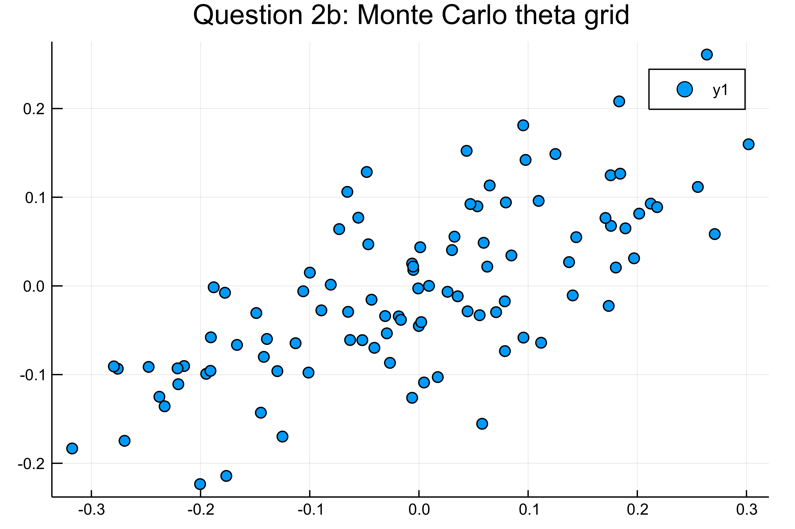

# Integration Homework - Solutions Branch


## question 1:

please look at the notebook for the analytic solution.  

The plot for q1 could look something like that:


## question 2

The plots for q2:  

  
  


## Run solution

do 

```julia
include("run.jl")  # runs solution
include("test/runtests.jl")  # runs tests
```
at the root of this package.


# License

Please observe that this repo is part of the [Sciences Po CompEcon Organisation](https://github.com/ScPo-CompEcon) and therefore subject to the license detailed at the bottom of [The Syllabus repo](https://github.com/ScPo-CompEcon/Syllabus).
